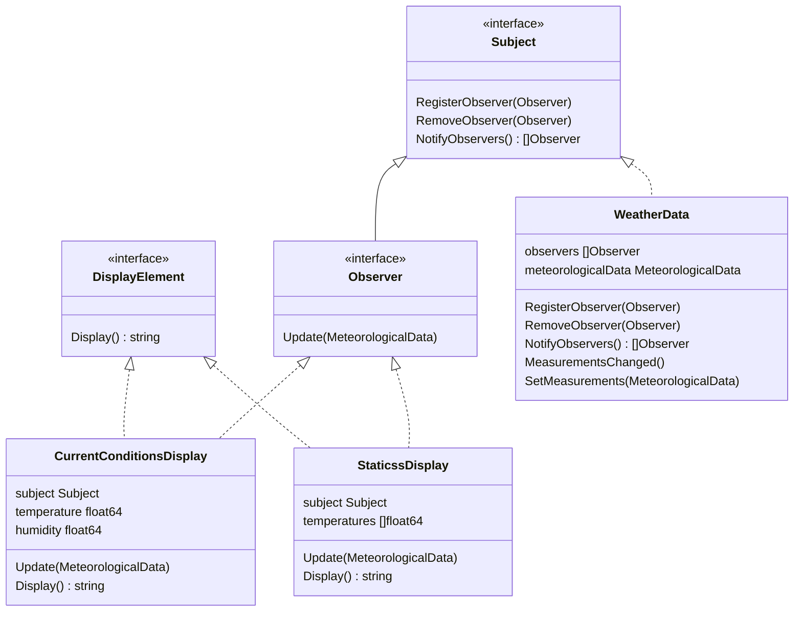

# observer

```mermaid
classDiagram
    DisplayElement  <|.. CurrentConditionsDisplay
    DisplayElement  <|.. StaticssDisplay
    Subject <|-- Observer
    Subject <|.. WeatherData
    Observer  <|.. CurrentConditionsDisplay
    Observer  <|.. StaticssDisplay
    class Subject{
       <<interface>>
      RegisterObserver(Observer)
      RemoveObserver(Observer)
      NotifyObservers() []Observer
    }
    class Observer{
       <<interface>>
      Update(MeteorologicalData)
    }
    class DisplayElement{
       <<interface>>
      Display() string
    }
    class WeatherData{
      observers []Observer
      meteorologicalData MeteorologicalData
      RegisterObserver(Observer)
      RemoveObserver(Observer)
      NotifyObservers() []Observer
      MeasurementsChanged()
      SetMeasurements(MeteorologicalData)
    }

    class CurrentConditionsDisplay{
      subject Subject 
      temperature float64
      humidity float64
      Update(MeteorologicalData)
      Display() string
    }
    class StaticssDisplay{
      subject Subject 
      temperatures []float64
      Update(MeteorologicalData)
      Display() string
    }
```