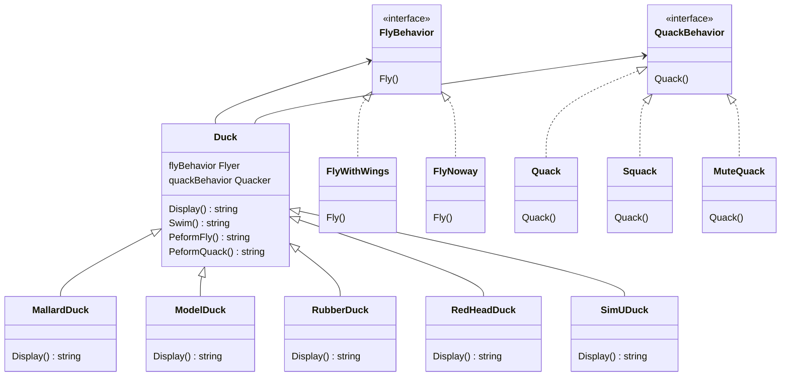

# strategy

```mermaid
classDiagram
    Duck <|-- MallardDuck
    Duck <|-- ModelDuck
    Duck <|-- RubberDuck
    Duck <|-- RedHeadDuck
    Duck <|-- SimUDuck
    FlyBehavior  <-- Duck
    FlyBehavior  <|.. FlyWithWings
    FlyBehavior  <|.. FlyNoway
    QuackBehavior  <-- Duck
    QuackBehavior  <|.. Quack
    QuackBehavior  <|.. Squack
    QuackBehavior  <|.. MuteQuack
    class Duck{
      flyBehavior Flyer
      quackBehavior Quacker
      Display() string
      Swim() string
      PeformFly() string
      PeformQuack() string
    }
    class MallardDuck{
      Display() string
    }
    class ModelDuck{
      Display() string
    }
    class RubberDuck{
      Display() string
    }
    class RedHeadDuck{
      Display() string
    }
    class SimUDuck{
      Display() string
    }
    class FlyBehavior{
      <<interface>>
      Fly()
    }
    class FlyWithWings{
      Fly()
    }
    class FlyNoway{
      Fly()
    }
    class QuackBehavior{
      <<interface>>
      Quack()
    }
    class Quack{
      Quack()
    }
    class Squack{
      Quack()
    }
    class MuteQuack{
      Quack()
    }
```